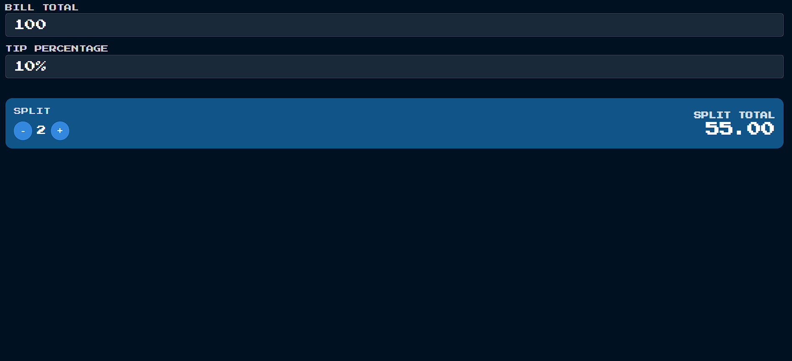
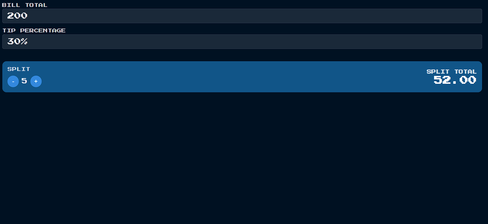

# SPLIT CALCULATOR
Split Calculator is a simple and interactive tool built with React.js that allows users to calculate how much each person should pay when splitting a bill, including a customizable tip percentage.  
It provides real-time updates as users adjust the bill total, tip percentage, and number of people splitting the bill.  
Designed with a clean and responsive user interface for smooth user experience.

## Features
- Enter the total bill amount and tip percentage.
- Adjust the number of people to split the bill.
- Instant real-time calculation of per-person cost.
- Minimalistic, responsive, and user-friendly design.

## Screenshots

<!-- First image -->

<!-- Second image -->

## Tech Stack
- React.js
- CSS3
- Yarn

## Demo
- **Live App**: [https://splitcalculatorusing-reactjs.vercel.app/](splitcalculatorusing-reactjs.vercel.app/)
- **Deployment**: Powered by Vercel

- ## License

This project is licensed under the MIT License - see the [LICENSE](LICENSE) file for details.
